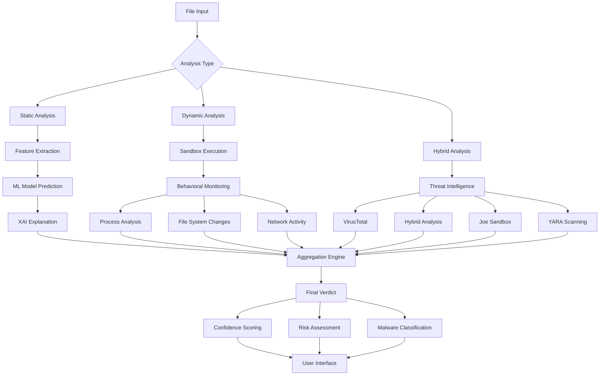

# Cerberus AI Cybershield 🛡️

[](https://opensource.org/licenses/MIT)
[](https://www.python.org/downloads/)
[](https://pypi.org/project/Flask/)

**Advanced Multi-Layered Malware Analysis and Protection System**

---

## 🔍 Overview

Cerberus AI Cybershield is a comprehensive, intelligent malware analysis framework designed to provide multi-layered defense against modern cyber threats. Leveraging static analysis, machine learning, dynamic behavioral analysis, advanced sandboxing, and multi-source threat intelligence, Cerberus delivers robust protection against known and unknown malware across various file formats.

The system empowers security analysts, incident responders, and developers to:
- **Triage files quickly and safely** through static analysis without execution
- **Detect novel threats** using machine learning models trained on deep file features
- **Understand verdicts** through explainable AI features that show why a file was classified as malicious
- **Automate analysis** with batch processing and API capabilities
- **Monitor proactively** with real-time file system monitoring
- **Enhance browser security** with a Chrome extension for Gmail attachment protection

---

## 🚨 The Problem Cerberus Solves

In today's evolving cybersecurity landscape, traditional malware detection methods struggle to keep pace with increasingly sophisticated threats:

1. **Zero-Day Attacks**: Signature-based detection is ineffective against previously unknown malware
2. **Manual Analysis Bottleneck**: Security teams are overwhelmed by the volume of files requiring investigation
3. **Lack of Transparency**: Automated tools often operate as "black boxes" without explaining their decisions
4. **Evasion Techniques**: Modern malware uses anti-analysis techniques to avoid detection
5. **Multi-Vector Attacks**: Threats come through various channels including email attachments, downloads, and network traffic

---

## 💡 Key Features

### 🤖 AI-Driven Static Analysis
- **Deep Feature Extraction**: Performs in-depth static analysis without executing files
- **Multi-File Format Support**: PE files (.exe/.dll), documents (.doc/.pdf), scripts (.js/.ps1), and archives
- **Risk Assessment**: Enables safer triage by analyzing files before execution

### 💡 Machine Learning Detection
- **Random Forest Classifier**: Trained on extracted static features for pattern recognition
- **High Accuracy**: Effective against known malware families and unknown variants
- **Confidence Scoring**: Provides prediction confidence levels for better decision-making

### 🔬 Dynamic Analysis
- **Controlled Execution**: Runs files in isolated environments to observe behavior
- **Behavioral Monitoring**: Captures process activity, file system changes, registry modifications, and network connections
- **Sandbox Integration**: Advanced Docker-based sandboxing for comprehensive analysis

### ❓ Explainable AI (XAI)
- **SHAP Integration**: Uses SHapley Additive exPlanations to interpret ML model predictions
- **Feature Visualization**: Shows which static features most influenced the classification
- **Transparency**: Builds trust in AI decisions with clear justifications

### 🌍 Multi-Source Threat Intelligence
- **VirusTotal API**: Checks file hashes against extensive malware databases
- **Hybrid Analysis**: Cloud-based sandboxing services integration
- **Joe Sandbox**: Advanced behavioral analysis platform
- **YARA Rules**: Pattern matching for known malware signatures
- **IOC Database**: Indicators of compromise tracking and matching

### 🖥️ Document Analysis
- **Macro Detection**: Identifies malicious macros in Office documents
- **Embedded Object Analysis**: Detects suspicious embedded content
- **Risk Scoring**: Comprehensive document risk assessment

### ⏱️ Real-Time Monitoring
- **File System Monitoring**: Watches directories for new/modified files
- **Process Behavior Analysis**: Identifies suspicious running processes
- **Automated Analysis**: Queues detected items for comprehensive analysis
- **Proactive Protection**: Detects threats as they emerge on the system

### 🌐 Chrome Extension
- **Gmail Protection**: Scans email attachments in real-time
- **URL Scanning**: Analyzes web links for malicious content
- **Visual Indicators**: Clear status indicators for attachment safety
- **Statistics Dashboard**: Tracks scanned attachments and detected threats

### 🛡️ Advanced Anti-Evasion
- **VM Detection Countermeasures**: Bypasses anti-VM techniques used by malware
- **Anti-Debug Detection**: Identifies and neutralizes anti-debugging methods
- **Time-Based Evasion**: Handles sleep/delay-based evasion techniques
- **Packing Detection**: Identifies packed/obfuscated malware samples

---

## 🏗️ Architecture

Cerberus employs a modular, multi-stage pipeline for comprehensive malware analysis:



---

## 🧰 Technology Stack

### Core Technologies
- **Language**: Python 3.8+
- **Web Framework**: Flask
- **Machine Learning**: Scikit-learn, Joblib, Pandas, NumPy
- **Explainability**: SHAP, LIME
- **Containerization**: Docker

### Analysis Components
- **Static Analysis**: PEFile, python-magic
- **Dynamic Analysis**: psutil, subprocess
- **Document Analysis**: olefile, lxml
- **Threat Intelligence**: requests, vt-py
- **Real-Time Monitoring**: watchdog, psutil
- **Visualization**: matplotlib, seaborn, plotly

### Security & Infrastructure
- **Sandboxing**: Docker containers
- **File Analysis**: YARA rules
- **Memory Analysis**: volatility3
- **Production Server**: Waitress WSGI

---

## 📁 Project Structure

```
cerberus-ai-cybershield/
├── ML_model/                 # Pre-trained machine learning models
├── chrome_extension/         # Browser security extension
├── Dataset/                  # Training data and samples
├── VT/                       # VirusTotal integration
├── templates/                # Web interface templates
├── uploads/                  # File upload directory
├── results/                  # Analysis results storage
├── batch_results/            # Batch processing results
├── temp_uploads/             # Temporary file storage
├── yara_rules/               # YARA signature rules
├── tests/                    # Unit and integration tests
├── __pycache__/              # Python cache files
│
├── app.py                    # Main Flask application
├── streamlit_app.py          # Streamlit web interface
├── batch_processor.py        # Batch file processing engine
├── feature_extraction.py     # Static feature extraction
├── predict_file.py           # Single file prediction
├── run_batch_test.py         # Batch testing utility
├── realtime_monitor.py       # Real-time file monitoring
├── dynamic_analysis.py       # Dynamic behavioral analysis
├── document_analyzer.py      # Document file analysis
├── malware_types.py          # Malware classification
├── model_explainer.py        # XAI model explanation
├── threat_intelligence.py    # Multi-source threat intel
├── threat_dashboard.py       # Threat intelligence dashboard
├── advanced_sandbox.py       # Docker-based sandboxing
├── anti_evasion.py           # Anti-evasion detection
├── vt_api.py                 # VirusTotal API integration
│
├── requirements.txt          # Python dependencies
├── README.md                 # Project documentation
├── .gitignore                # Git ignore rules
└── LICENSE                   # MIT License
```

---

## 🚀 Installation

### Prerequisites
- Python 3.8 or higher
- Docker (for advanced sandboxing)
- Git (for cloning the repository)
- At least 8GB RAM recommended
- Windows, macOS, or Linux operating system

### Quick Setup

1. **Clone the Repository**
   ```bash
   git clone https://github.com/Manjesh501/Cerberus-ai-cybershield.git
   cd Cerberus-ai-cybershield
   ```

2. **Create Virtual Environment**
   ```bash
   python3 -m venv venv
   source venv/bin/activate  # Linux/macOS
   # venv\Scripts\activate   # Windows
   ```

3. **Install Dependencies**
   ```bash
   pip install -r requirements.txt
   ```

4. **Download Pre-trained Model**
   Ensure the pre-trained model file exists at `ML_model/malwareclassifier-V2.pkl`
   If not available, train your own model using the provided training scripts.

5. **Configure API Keys (Optional)**
   Create a `config.json` file in the root directory:
   ```json
   {
       "virustotal_api_key": "YOUR_VT_API_KEY",
       "hybrid_analysis_api_key": "YOUR_HA_API_KEY",
       "joe_sandbox_api_key": "YOUR_JOE_API_KEY"
   }
   ```

6. **Start the Application**
   ```bash
   python app.py
   ```
   The application will be available at `http://localhost:5000`

---

## 🖥️ Usage

### Web Interface
Access the main dashboard at `http://localhost:5000` to:
- Upload and analyze individual files
- View detailed analysis results
- Monitor real-time threat detection
- Access threat intelligence dashboard

### Streamlit Interface
Run the Streamlit web interface for batch processing:
```bash
streamlit run streamlit_app.py
```

### Command-Line Analysis

#### Single File Analysis
```bash
python predict_file.py /path/to/your/file.exe
```

#### Batch Analysis
```bash
# Interactive batch processing
python run_batch_test.py --interactive

# Analyze a single file
python run_batch_test.py malware_sample.exe

# Analyze directory with custom model
python run_batch_test.py test_samples/ --model-path my_model.pkl --static-only

# Hybrid analysis with VirusTotal
python run_batch_test.py test_samples/ --hybrid --vt-api-key YOUR_API_KEY
```

#### Real-Time Monitoring
```bash
# Monitor Downloads directory
python realtime_monitor.py -w /path/to/Downloads

# Monitor multiple directories
python realtime_monitor.py -w /path/to/Downloads -w /path/to/Documents
```

### API Endpoints

#### File Analysis
```bash
curl -X POST -F "file=@/path/to/file.exe" http://localhost:5000/api/analyze
```

#### URL Scanning
```bash
curl -X POST -H "Content-Type: application/json" \
     -d '{"url": "http://example.com/malicious"}' \
     http://localhost:5000/api/scan-url
```

#### Real-Time Monitoring Control
```bash
# Start monitoring
curl -X POST http://localhost:5000/api/realtime/start

# Stop monitoring
curl -X POST http://localhost:5000/api/realtime/stop

# Get status
curl http://localhost:5000/api/realtime/status
```

---

## 🔧 Chrome Extension

### Installation
1. Open Chrome and navigate to `chrome://extensions/`
2. Enable "Developer mode"
3. Click "Load unpacked" and select the `chrome_extension` folder
4. The Cerberus icon will appear in your toolbar

### Features
- **Gmail Attachment Scanning**: Automatically scans email attachments
- **Visual Indicators**: Color-coded safety indicators for attachments
- **Rescan Functionality**: Manually trigger attachment re-scanning
- **Statistics Dashboard**: Track scanned files and detected threats
- **URL Protection**: Analyze web links before visiting

---

## 🧪 Testing and Development

### Unit Tests
Run the test suite:
```bash
pytest tests/
```

### Sample Files
The `test_samples/` directory contains various file types for testing:
- Clean files for baseline testing
- Known malware samples (for testing only in isolated environments)
- Suspicious files with various characteristics

### Development Guidelines
1. Always test in isolated environments
2. Never run unknown malware on production systems
3. Use VMs or dedicated analysis machines
4. Regularly update threat intelligence feeds
5. Monitor system resources during analysis

---

## ⚠️ Security Considerations

### Safe Usage Guidelines
- **Never run on production systems**: Use isolated VMs or dedicated analysis environments
- **Network isolation**: Disconnect from the internet during analysis
- **Resource monitoring**: Monitor CPU, memory, and disk usage
- **Regular updates**: Keep threat intelligence feeds current
- **Backup systems**: Maintain backups of analysis environments

### Risk Mitigation
- **Timeout mechanisms**: Prevent infinite loops and resource exhaustion
- **Memory limits**: Restrict memory usage during analysis
- **Process isolation**: Use containers for enhanced isolation
- **Blacklist management**: Skip known problematic files
- **Error handling**: Graceful degradation on component failures

---

## 📊 Threat Intelligence Dashboard

Access the threat intelligence dashboard at `http://localhost:5000/dashboard` to view:
- **Geographic Distribution**: Global threat distribution maps
- **Malware Trends**: Historical malware detection trends
- **Attack Vectors**: Common attack methodologies
- **Sector Analysis**: Industry-specific threat patterns
- **Real-time Monitoring**: Live threat detection feed

---

## 🤝 Contributing

Contributions are welcome! Please follow these steps:

1. Fork the repository
2. Create a feature branch (`git checkout -b feature/AmazingFeature`)
3. Commit your changes (`git commit -m 'Add some AmazingFeature'`)
4. Push to the branch (`git push origin feature/AmazingFeature`)
5. Open a Pull Request

### Areas for Contribution
- **New Analysis Modules**: Additional file format support
- **Improved ML Models**: Enhanced detection algorithms
- **UI/UX Enhancements**: Better visualization and user experience
- **Performance Optimization**: Faster processing and reduced resource usage
- **Documentation**: Improved guides and examples
- **Testing**: Additional test cases and sample files

---

## 📚 Documentation

### API Documentation
Detailed API documentation is available at `http://localhost:5000/api/docs` when the application is running.

### Component Documentation
Each major component has inline documentation:
- `feature_extraction.py`: Static feature extraction methods
- `dynamic_analysis.py`: Behavioral analysis techniques
- `model_explainer.py`: Explainable AI implementation
- `threat_intelligence.py`: Multi-source threat intelligence integration
- `realtime_monitor.py`: Real-time file system monitoring

---

## 🐛 Troubleshooting

### Common Issues

#### Docker Not Available
If Docker is not installed, the advanced sandboxing features will be disabled. Install Docker Desktop for your platform.

#### Memory Issues
For large file analysis, increase system memory or reduce the number of concurrent workers.

#### API Key Errors
Ensure API keys are correctly configured in `config.json` or environment variables.

#### File Permission Errors
Run the application with appropriate permissions for file access and analysis.

### Debugging
Check log files for detailed error information:
- `app.log`: Main application logs
- `batch_processor.log`: Batch processing logs
- `realtime_monitor.log`: Real-time monitoring logs
- `model_explainer.log`: XAI explanation logs

---

## 📈 Performance Benchmarks

### Analysis Times (Approximate)
- **Static Analysis**: 1-5 seconds per file
- **Dynamic Analysis**: 30-120 seconds per file
- **Hybrid Analysis**: 60-180 seconds per file
- **Batch Processing**: 100+ files per hour (varies by system)

### Resource Usage
- **Memory**: 500MB-2GB during active analysis
- **CPU**: 1-4 cores depending on analysis type
- **Disk**: 100MB-1GB for temporary files and results

---

## 🔄 Future Development

### Planned Features
1. **Deep Learning Models**: Neural network-based malware detection
2. **Advanced Visualization**: Interactive threat analysis dashboards
3. **Mobile Analysis**: Android/iOS malware detection capabilities
4. **Cloud Integration**: AWS/GCP/Azure deployment options
5. **Automated Response**: Integration with SIEM and SOAR platforms
6. **Enhanced Sandboxing**: Full system emulation and memory analysis
7. **Behavioral Profiling**: User and entity behavior analytics
8. **Threat Hunting**: Proactive threat discovery capabilities

### Research Areas
- **Zero-Day Detection**: Advanced heuristic analysis
- **Fileless Malware**: Memory-resident threat detection
- **AI Adversarial Defense**: Protection against AI-based attacks
- **Quantum-Resistant Security**: Preparation for post-quantum cryptography

---

## 📄 License

This project is licensed under the MIT License - see the [LICENSE](LICENSE) file for details.

**Important Notice**: This software is provided for educational and research purposes only. The authors are not responsible for any misuse or damage caused by this software. Always use in isolated environments and comply with all applicable laws and regulations.

---

## 🙏 Acknowledgements

- **Scikit-learn Team**: For the excellent machine learning library
- **Docker Team**: For containerization technology
- **VirusTotal**: For threat intelligence services
- **Hybrid Analysis**: For cloud sandboxing platform
- **Joe Sandbox**: For advanced behavioral analysis
- **Open Source Community**: For various libraries and tools

---

## 📞 Support

For issues, questions, or contributions, please:
1. Check the existing issues on GitHub
2. Create a new issue with detailed information
3. Contact the maintainers through GitHub
4. Join the community discussions

---

*🛡️ Protect your digital assets with Cerberus AI Cybershield - Advanced malware protection for the modern threat landscape.*